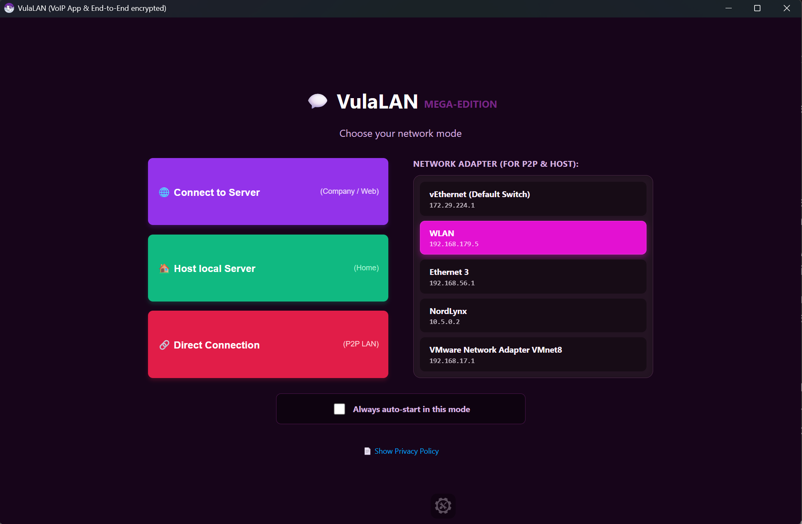
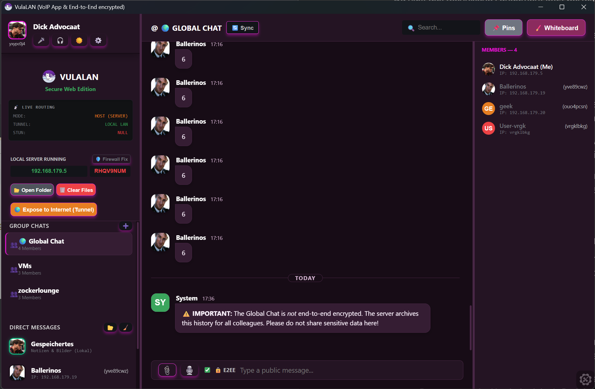

# VulaLAN

VulaLAN is an app (.exe) and a self-hostable web app that allows its users to communicate with each other. Its design is almost fully local and "off-grid", with the only exception being optionally availabe STUN-servers of Mozilla and Cloudflare for communication via a cloudflare (internet) tunnel between users. The use of these STUN-servers can be turned off in the settings for 100 % assured offline & local use. 

You can write (text chat), call (voice chat/VoIP), upload small and large files (1+ GB) and screenshare with/to each other, in groups with multiple people or in DMs (direct messages). 

The app is explicitly designed for local, secure, and private use via LAN or VPN, having no own servers or databases. It's all in the hands of the users, off-grid and decentralized. Also, all small files (up to 15 MB) and messages, except in the global chat, are end-to-end encrypted, and large files (above 15 MB) optionally, too. The global chat is saved on each users local database (IndexedDB, from JavaScript) and on the persons who decide to host servers, too, so that new members/users can see the old chats and chat history. With E2E encryption this wouldn't be possible. 

The app works in either a P2P (Peer to Peer) mode or in a system where one user hosts a server and everyone else connects to that server via an IP address or DNS-name (A record). 

The Peer-to-Peer-mode has no server as a medium in between two users and thereby allows for the minimum of security concerns.

If one hosts (and has not turned the PIN requirement off in the settings), the server generates a random 8-digit PIN ("password") that every user, which wants to connect to the server, has to enter when joining. As the hoster, you can also open up your server to the internet by clicking the orange button, although this sounds unsafer than it actually is. Your pc will run a powershell script that downloads and runs cloudflare script, which constructs a virtual tunnel from your end to cloudflare's servers and links cloudflare's end to a dns/web address like "menus-recorder-lakes-ads.trycloudflare.com". Now, if someone wants to have a connection with you, even though you are not in the same LAN or VPN, they can type that address into their web browser or in the app and connect to you without having to install a VPN, or the app entirely, if they are using a browser. That should be very comfortable for the users, and safe, too. The cloudflare tunnel to your device (and ONLY for a specific port) will automatically close down once you exit/stop the app.

The STUN servers are required for the call function over a cloudflare tunnel, because the internet routers of each user has to be able to calculate a path to the other. They are not required for anything else except internet use, basically.

There is a Powershell-Script to add new rules to the Windows Defender Firewall, allowing Ports 8181 and 3000, which are required for the server host and for P2P connections. 

You can change your user name, profile picture, toggle a white mode, change the theme color to anything you like, make chat rooms/groups, and so much more!

The programm (VulaLAN) is available in English and German, though there may be some translations still missing. The inspiration of the name comes from the Xhosa word "vula", which means "to open something".

## Installation
1. clone the repository to your local machine.
2. Open your terminal or PowerShell in the repository/directory/folder and execute the command `npm install`.
3. execute the command `npm run build` to create the .exe file for Windows. 